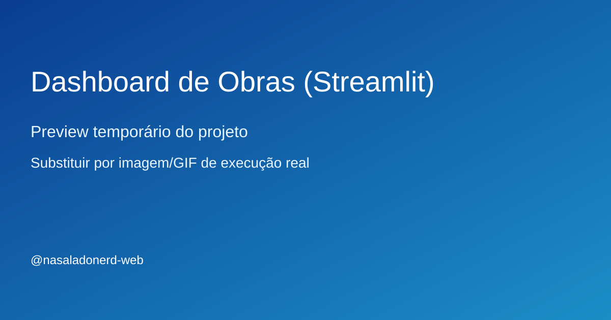

# Dashboard de Obras (Streamlit)

## Problema
Dificuldade de acompanhar avanço físico-financeiro e desvios de cronograma em uma visão única e atualizada.

## Solução
Aplicação em Streamlit com indicadores de obra, curva S, filtros por período e alertas visuais de variação.

## Stack
- Python, Streamlit, pandas, plotly

## Resultado
- Estrutura inicial pronta para evolução incremental
- Base de código organizada para testes e documentação
- Repositório preparado para vitrine técnica no GitHub

## Demonstração


> Substitua depois por GIF real da execução (ex.: assets/demo.gif) assim que a primeira versão funcional estiver pronta.

## Status
**Em evolução**

## Roadmap curto
- [ ] Implementar versão mínima funcional (MVP)
- [ ] Adicionar exemplo de entrada e saída
- [ ] Publicar GIF de execução no README
- [ ] Criar seção de lições aprendidas

## Como executar (placeholder)
```bash
# em breve
```
